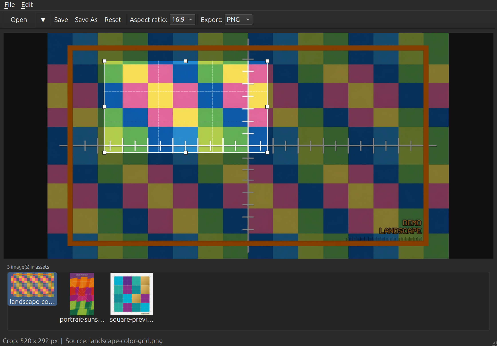
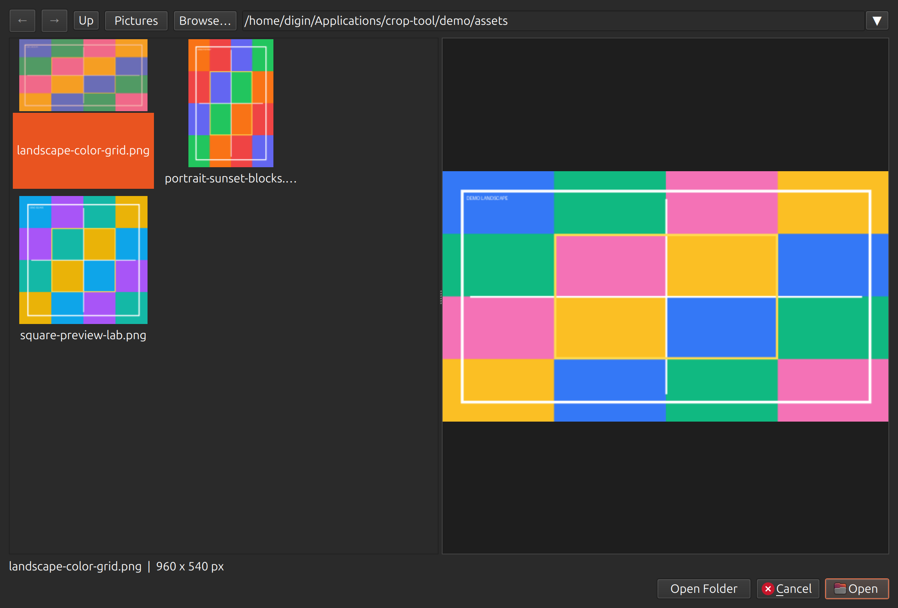

# Crop Tool

A lightweight desktop image cropper built with PySide6.

## Screenshots





## Install

**One-command install (pulls all dependencies automatically):**

```bash
./scripts/install.sh
crop-tool
```

Uses `pipx` when available, otherwise installs into `~/.local/share/crop-tool`.

**Recommended (isolated CLI tool):**

```bash
pipx install .
crop-tool
```

**Project virtual environment:**

```bash
python3 -m venv .venv
source .venv/bin/activate
pip install -e .
crop-tool
```

**System-wide** (if your Python allows it):

```bash
pip install .
```

## Standalone bundle (no Python/pip needed on target machine)

Build on your dev machine:

```bash
./scripts/build-bundle.sh
```

Run the bundled app:

```bash
./dist/crop-tool/crop-tool
```

Copy the entire `dist/crop-tool/` folder to another Linux PC (same CPU architecture) to distribute.

## Launch

```bash
crop-tool
```

Open an image from the UI, or pass a file path:

```bash
crop-tool photo.jpg
```

You can also run it as a module:

```bash
python -m crop_tool
```

## Usage

1. **Open** an image (File → Open, toolbar, or pass a path on the command line).
2. **Drag** on the image to draw a crop region, or drag handles to resize.
3. Choose an **aspect ratio** from the toolbar (optional).
4. **Save As** to export the cropped image.

### Shortcuts

| Action    | Shortcut        |
|-----------|-----------------|
| Open      | `Ctrl+O`        |
| Save As   | `Ctrl+Shift+S`  |
| Reset crop| `Ctrl+R`        |
| Quit      | `Ctrl+Q`        |